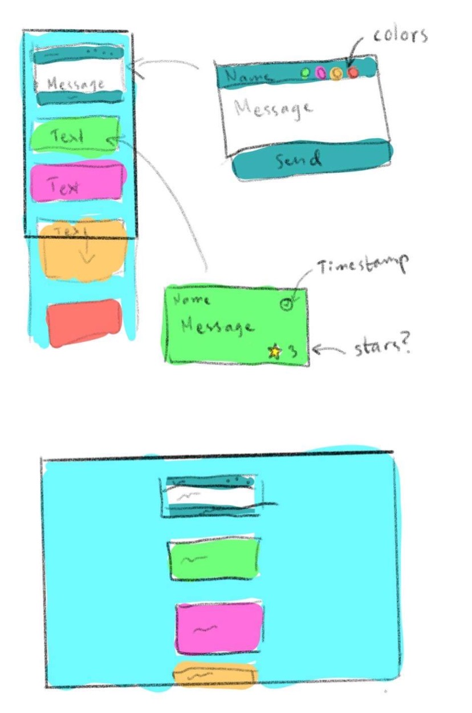

# VC-slutprojekt-grupp3
 Messaging application on the web using firebase.

## Features 

Användaren kan skriva in sitt username, välja en färg på sitt meddelande och skicka iväg det. I meddelandet syns även datum och tidpunkt. 

## Mockups 

I vårt projekt valde vi att göra en kombination av wireframe och mockup istället för två separata, eftersom att det är ett litet projekt med få funktioner och inga undersidor. Dessutom går det inte att kontrollera hur slutprodukten blir eftersom att vi kommer ta in features och nya koncept från andra grupper.  
Vi utgick från en simpel design och livade upp den med flera olika färger på meddelandena. Vi vill ge ett lekfullt och enkelt intryck. Det öppnar upp för andra grupper att vara kreativa med vad de ska bidra till.  

## Databas 

Firebase: https://firebase.google.com 

## Credits

### Gruppmedlemmar
Eddie Peters  
Anna Sundberg  
Signe Lindström  
Louise Kanizsai Ståhl  

### Contributions 

Se separat wiki för contributions från andra grupper,

### Länkar

Trello kanban: https://trello.com/b/T7QU6Cre/grupp-3-slutprojekt  